<div align="center">

```
███████╗ ██████╗ ██████╗ ███████╗ ██████╗ █████╗ ███████╗████████╗██╗ ██████╗
██╔════╝██╔═══██╗██╔══██╗██╔════╝██╔════╝██╔══██╗██╔════╝╚══██╔══╝██║██╔═══██╗
█████╗  ██║   ██║██████╔╝█████╗  ██║     ███████║███████╗   ██║   ██║██║   ██║
██╔══╝  ██║   ██║██╔══██╗██╔══╝  ██║     ██╔══██║╚════██║   ██║   ██║██║▄▄ ██║
██║     ╚██████╔╝██║  ██║███████╗╚██████╗██║  ██║███████║   ██║   ██║╚██████╔╝
╚═╝      ╚═════╝ ╚═╝  ╚═╝╚══════╝ ╚═════╝╚═╝  ╚═╝╚══════╝   ╚═╝   ╚═╝ ╚══▀▀═╝
```

### AI Predictive Forecasting Platform

**NatWest Code for Purpose Hackathon — AI Predictive Forecasting Track**

[](https://flask.palletsprojects.com/)
[](https://nextjs.org/)
[](https://facebook.github.io/prophet/)
[](https://aistudio.google.com/)
[](https://www.typescriptlang.org/)
[](https://www.python.org/)
[](LICENSE)
[](https://developercertificate.org/)

</div>

---

## Table of Contents

- [Overview](#overview)
- [User Journey](#user-journey)
- [Features](#features)
- [System Architecture](#system-architecture)
- [Data Flow Diagrams](#data-flow-diagrams)
  - [1 · Forecast Pipeline](#1--forecast-pipeline)
  - [2 · Anomaly Detection Pipeline](#2--anomaly-detection-pipeline)
  - [3 · AI Fallback Chain](#3--ai-fallback-chain)
  - [4 · Scenario Engine](#4--scenario-engine)
  - [5 · CSV Upload & Validation](#5--csv-upload--validation)
  - [6 · Authentication Flow](#6--authentication-flow)
  - [7 · Frontend State Flow](#7--frontend-state-flow)
  - [8 · API Request / Response Lifecycle](#8--api-request--response-lifecycle)
- [Component Hierarchy](#component-hierarchy)
- [Prophet Model — How It Works](#prophet-model--how-it-works)
- [Anomaly Detection — How Z-Score Works](#anomaly-detection--how-z-score-works)
- [Fallback Model Selection](#fallback-model-selection)
- [Folder Structure](#folder-structure)
- [Tech Stack](#tech-stack)
- [Install and Run](#install-and-run)
- [Usage Examples](#usage-examples)
- [API Reference](#api-reference)
- [Environment Variables](#environment-variables)
- [Running Tests](#running-tests)
- [Troubleshooting](#troubleshooting)
- [Production Deployment](#production-deployment)
- [Limitations](#limitations)
- [Future Improvements](#future-improvements)

---

## Overview

**ForecastIQ** transforms raw historical CSV data into actionable predictions — no data science expertise required. It solves a fundamental problem: most teams only look backwards at their data, lacking accessible and transparent tools to understand what the future may hold.

Upload any time-series CSV and within seconds get Prophet-powered forecasts with honest uncertainty bands, rolling z-score anomaly alerts with AI-generated plain-English explanations, and a conversational "what-if" scenario engine. The system is built on a **graceful degradation philosophy** — even with zero API keys configured, it produces useful forecasts using local statistical models and deterministic rule-based explanations.

**Intended users:** Business analysts, operations teams, product managers, and anyone who works with time-series metrics (sales, traffic, usage, churn) and needs fast, trustworthy, explainable forecasts without a data science background.

---

## User Journey

The diagram below traces every path a user can take through ForecastIQ — from first visit to actionable insight.

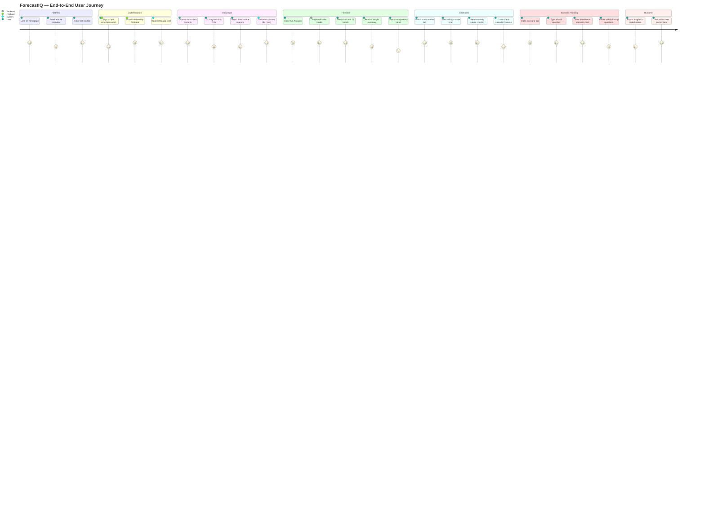

---

## Features

The following features are fully implemented and working:

- **Prophet forecasting** — generates 1–6 week ahead forecasts with low / likely / high uncertainty bands using Facebook Prophet
- **Local model fallback** — automatically selects the best local model (Naive, Seasonal Naive, Moving Average, Holt, Holt-Winters) by holdout MAE when Prophet is unavailable
- **Moving average baseline** — every forecast is benchmarked against a 4-week moving average to prevent overfitting claims
- **Outlier-aware comparison** — `/api/forecast/compare-cleaned` reruns the forecast with statistical outliers removed for side-by-side contrast
- **Rolling z-score anomaly detection** — flags unexpected spikes and dips at HIGH (≥ 3σ) and MEDIUM (≥ 2.5σ) severity; shift-corrected windows eliminate look-ahead bias
- **AI anomaly explanations** — Gemini 2.0 Flash generates a likely cause and recommended next action for each detected anomaly
- **Scenario chat** — multi-turn conversational interface for natural-language "what-if" questions
- **Rule-based scenario engine** — deterministic modelling for %, trend continuation, flatten, and outlier-removal scenarios; never fails without AI keys
- **Gemini → Groq → rule-based fallback chain** — all AI calls cascade through three layers; the app always produces output
- **Drag-and-drop CSV upload** — browser-side parser with column selection and ≥ 8 row validation
- **Demo mode** — ships with `demo_sales.csv` (52 weeks of synthetic data) for instant end-to-end testing
- **Firebase authentication** — email/password sign-up, login, and session persistence; protected routes redirect unauthenticated users
- **Transparency panel** — every forecast response exposes `model_used` and per-model MAE scores
- **Responsive UI** — mobile sidebar navigation, Recharts interactive charts, shadcn/ui, Tailwind CSS v4

> **Partial implementation note:** The voice input button (`VoiceButton` component) renders in the Scenario tab but speech-to-text is not wired to the chat input. It is a UI placeholder only.

---

## System Architecture

The diagram below shows the full runtime topology: browser, Next.js, Flask, and external AI services.

```
┌──────────────────────────────────────────────────────────────────────────────┐
│                            FORECASTIQ SYSTEM                                 │
│                                                                              │
│  ┌─────────────────────────────────────────────────────────────────────┐    │
│  │                   NEXT.JS FRONTEND  (Port 3000)                     │    │
│  │                                                                     │    │
│  │  ┌──────────────┐  ┌─────────────┐  ┌────────────────────────────┐ │    │
│  │  │ Firebase Auth│  │  AuthGuard  │  │       DataContext           │ │    │
│  │  │ (sign-in/up) │─▶│  (protect)  │  │  global state + CSV data   │ │    │
│  │  └──────────────┘  └─────────────┘  └────────────────────────────┘ │    │
│  │                                                                     │    │
│  │  ┌────────────┐  ┌────────────┐  ┌──────────────┐  ┌───────────┐  │    │
│  │  │  Forecast  │  │  Anomalies │  │   Scenario   │  │  Upload   │  │    │
│  │  │    Tab     │  │    Tab     │  │     Chat     │  │   Page    │  │    │
│  │  └─────┬──────┘  └─────┬──────┘  └──────┬───────┘  └─────┬─────┘  │    │
│  │        └───────────────┴─────────────────┴────────────────┘        │    │
│  │                              │  lib/api.ts                          │    │
│  └──────────────────────────────┼──────────────────────────────────────┘    │
│                                 │  HTTP / JSON                               │
│  ┌──────────────────────────────▼──────────────────────────────────────┐    │
│  │                   FLASK BACKEND  (Port 5000)                        │    │
│  │                                                                     │    │
│  │   POST /api/forecast          POST /api/anomalies                   │    │
│  │   POST /api/forecast/         POST /api/scenario                    │    │
│  │        compare-cleaned        GET  /health                          │    │
│  │                                                                     │    │
│  │  ┌──────────┐ ┌──────────┐ ┌──────────┐ ┌──────────┐ ┌─────────┐  │    │
│  │  │ prophet  │ │  local   │ │ anomaly  │ │ baseline │ │scenario │  │    │
│  │  │ service  │ │  models  │ │ service  │ │ service  │ │ engine  │  │    │
│  │  └──────────┘ └──────────┘ └──────────┘ └──────────┘ └─────────┘  │    │
│  │                                                                     │    │
│  │  ┌──────────────────────────────┐  ┌──────────────────────────┐    │    │
│  │  │       gemini_service         │  │    outlier_service        │    │    │
│  │  │  Gemini → Groq → rule-based  │  │  compare-cleaned flow     │    │    │
│  │  └──────────────────────────────┘  └──────────────────────────┘    │    │
│  └─────────────────────────────────────────────────────────────────────┘    │
│                                                                              │
│   ┌─────────────────────┐      ┌──────────────────────────────────────┐     │
│   │  Google Gemini API  │      │  Groq API  (Llama 3.1 — fallback)    │     │
│   │    (free tier)      │      │  (free tier)                         │     │
│   └─────────────────────┘      └──────────────────────────────────────┘     │
└──────────────────────────────────────────────────────────────────────────────┘
```

---

## Data Flow Diagrams

### 1 · Forecast Pipeline

This pipeline shows every decision point from raw CSV to the final JSON response the browser renders.

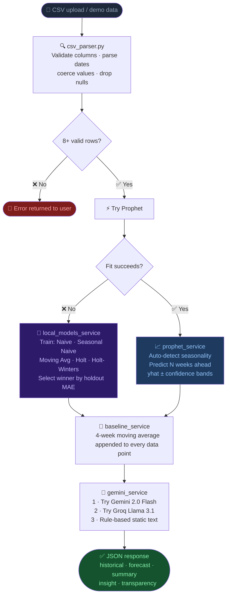

---

### 2 · Anomaly Detection Pipeline

The shift-by-1 step is the most important detail here — it ensures the rolling window never "sees" the current point when computing its own baseline.

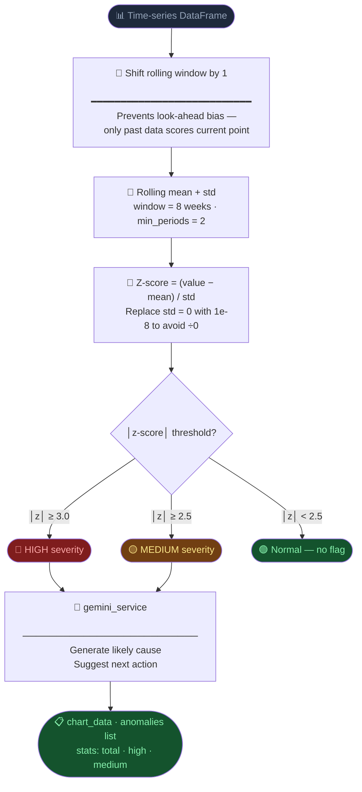

---

### 3 · AI Fallback Chain

Every AI request — whether for a forecast insight, anomaly explanation, or scenario summary — passes through this exact cascade. No request ever fails silently.

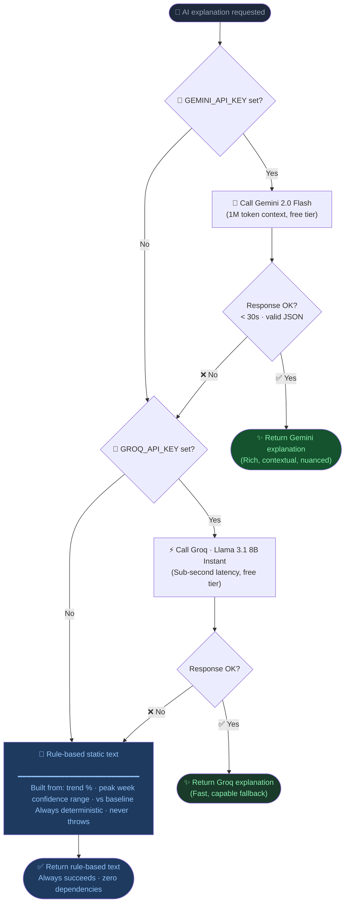

---

### 4 · Scenario Engine

The key design principle: the rule engine always computes the numeric result first; Gemini only wraps it in natural language.

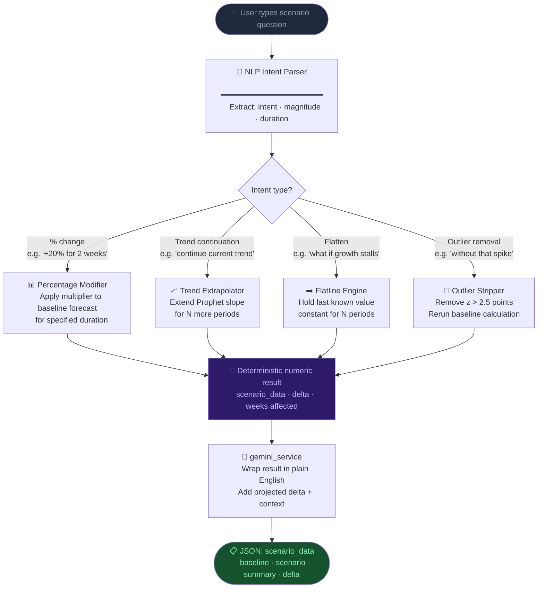

---

### 5 · CSV Upload & Validation

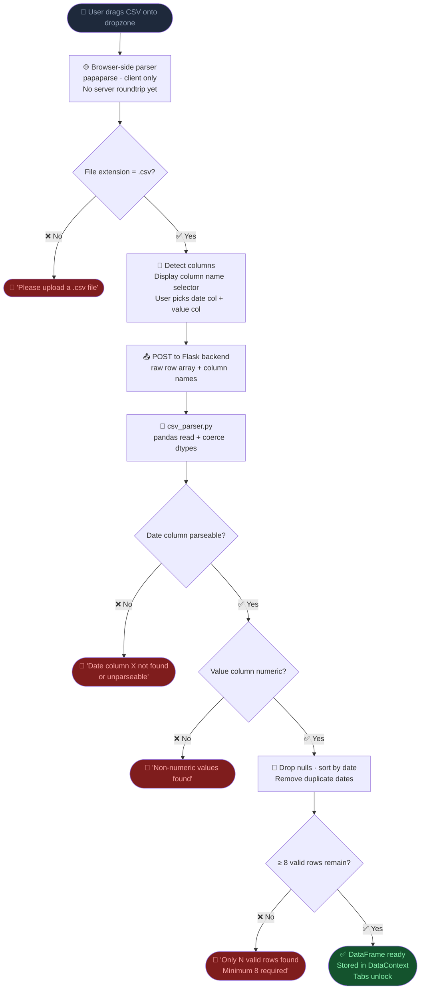

---

### 6 · Authentication Flow

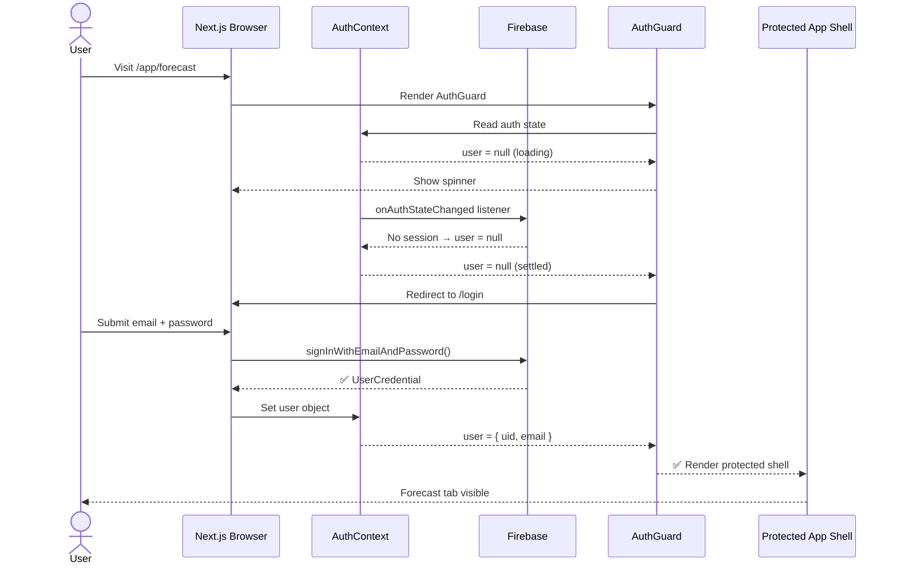

---

### 7 · Frontend State Flow

All global state lives in two React contexts. This diagram shows which components read from and write to each context.

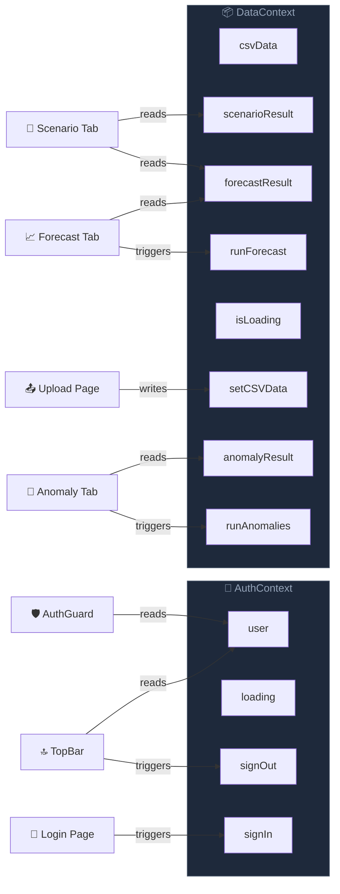

---

### 8 · API Request / Response Lifecycle

A sequence diagram tracing a single **Run Analysis** click from browser to response and back.

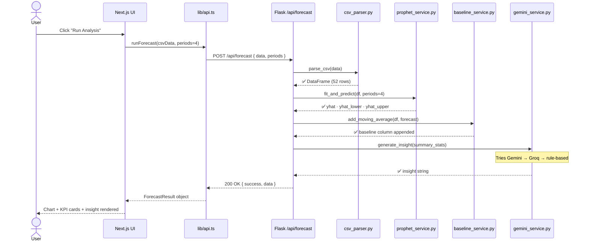

---

## Component Hierarchy

The full React component tree from root layout to individual chart leaves.

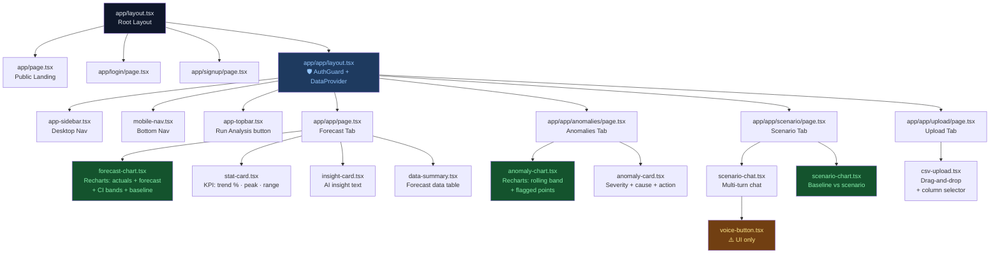

---

## Prophet Model — How It Works

This section explains the core forecasting model for readers unfamiliar with Facebook Prophet.

### Concept: Additive Decomposition

Prophet decomposes a time series into three interpretable components:

```
y(t) = trend(t) + seasonality(t) + holidays(t) + ε(t)
```

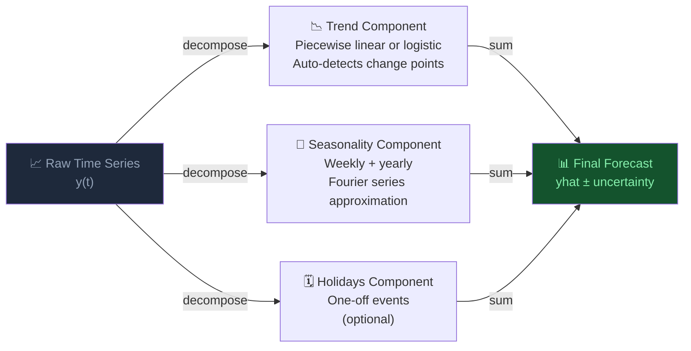

### Why Prophet over a Neural Network?

| Property | Prophet | LSTM / Transformer |
|---|---|---|
| **Interpretability** | ✅ Additive components, explainable | ❌ Black box |
| **Training time** | ✅ < 1 second on short series | ❌ Minutes–hours |
| **Data requirement** | ✅ Works with 50+ rows | ❌ Needs thousands |
| **Uncertainty** | ✅ Built-in credible intervals | ⚠️ Requires extra work |
| **Seasonality** | ✅ Auto-detected | ❌ Must be engineered |
| **Maintenance** | ✅ No GPU, no retraining pipeline | ❌ Complex MLOps |

### Uncertainty Bands

Prophet returns three columns for every future date:

```
yhat_lower  ─── Lower bound of 80% credible interval
yhat        ─── Most likely predicted value
yhat_upper  ─── Upper bound of 80% credible interval
```

These are visualised as a shaded area on the Forecast chart. The wider the band, the less certain the model is about that future period.

---

## Anomaly Detection — How Z-Score Works

### The Rolling Z-Score Formula

For each point `t`, the algorithm:

1. Takes the **previous** 8 data points (shifted by 1 to avoid look-ahead)
2. Computes rolling mean `μ` and rolling standard deviation `σ`
3. Computes `z = (value - μ) / σ`

```
z-score = (observed value − rolling mean) / rolling std deviation
```

### Severity Thresholds

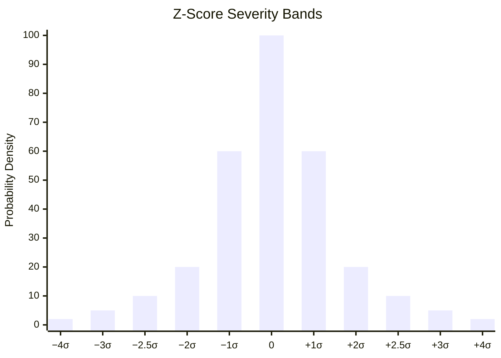

| Z-Score | Severity | Meaning |
|---|---|---|
| `│z│ ≥ 3.0` | 🔴 **HIGH** | Value is 3+ standard deviations from recent average — statistically very rare (< 0.3% under normal distribution) |
| `│z│ ≥ 2.5` | 🟡 **MEDIUM** | Value is 2.5+ standard deviations — worth investigating (< 1.2%) |
| `│z│ < 2.5` | 🟢 **Normal** | Within expected range — no flag |

### Why Shift the Window?

```
Without shift (❌ look-ahead bias):
  Window for point T: [T-7, T-6, T-5, T-4, T-3, T-2, T-1, T]
  Problem: The current point T influences its own baseline → anomalies can hide themselves

With shift (✅ correct):
  Window for point T: [T-8, T-7, T-6, T-5, T-4, T-3, T-2, T-1]
  The baseline for T is built from only past points → fair comparison
```

---

## Fallback Model Selection

When Prophet is unavailable (import error, insufficient data, fit failure), ForecastIQ automatically trains and evaluates five local models.

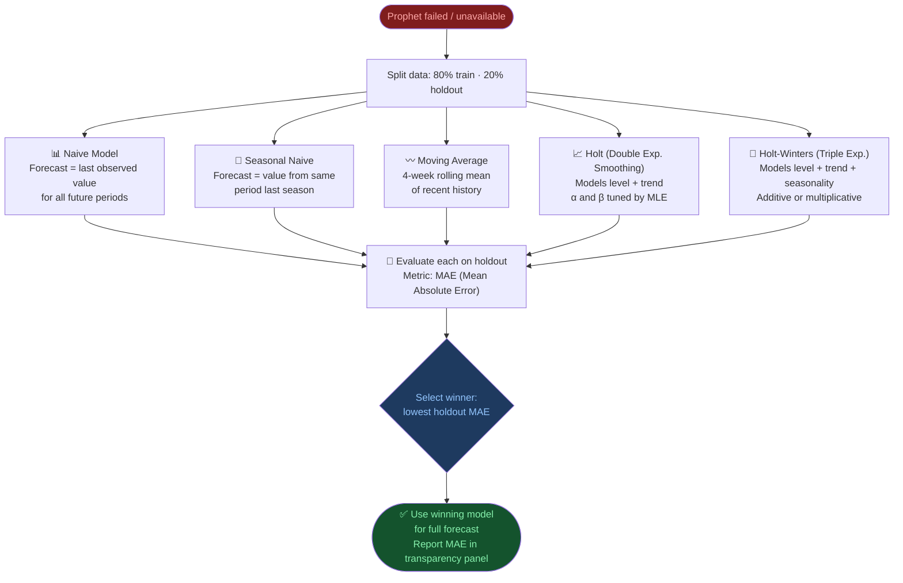

The winning model name and its MAE score are always surfaced in the **Transparency panel** on the Forecast tab — users can see exactly which model was used and how accurate it was on held-out data.

---

## Folder Structure

```
forecastiq/
│
├── README.md
│
├── backend/                            Flask 3 Python API
│   ├── app.py                          Application factory + blueprint registration
│   ├── config.py                       Centralised env var loading (single source of truth)
│   ├── requirements.txt                Python dependencies
│   ├── demo_sales.csv                  52-week synthetic dataset for demo mode
│   ├── .env.example                    Environment variable template (no real secrets)
│   ├── .gitignore
│   │
│   ├── routes/
│   │   ├── __init__.py
│   │   ├── forecast.py                 POST /api/forecast + /api/forecast/compare-cleaned
│   │   ├── anomalies.py                POST /api/anomalies
│   │   └── scenario.py                 POST /api/scenario
│   │
│   ├── services/
│   │   ├── __init__.py
│   │   ├── prophet_service.py          Facebook Prophet wrapper (auto-tuned hyperparams)
│   │   ├── local_models_service.py     5 local models, selected by holdout MAE
│   │   ├── anomaly_service.py          Rolling z-score, shift-corrected windows
│   │   ├── baseline_service.py         4-week moving average reference line
│   │   ├── scenario_engine.py          Deterministic rule-based scenario modeller
│   │   ├── outlier_service.py          Outlier removal + cleaned forecast comparison
│   │   └── gemini_service.py           Gemini → Groq → static text fallback chain
│   │
│   ├── utils/
│   │   ├── __init__.py
│   │   └── csv_parser.py               CSV validation + pandas DataFrame builder
│   │
│   └── tests/
│       ├── __init__.py
│       ├── test_anomaly.py             Pytest: z-score correctness, severity flags, bands
│       ├── test_baseline.py            Pytest: moving average computation accuracy
│       └── test_csv_parser.py          Pytest: edge cases — bad dates, missing cols, nulls
│
└── frontend/                           Next.js 15 TypeScript application
    ├── package.json
    ├── next.config.mjs
    ├── tsconfig.json
    ├── .env.local.example              Frontend env var template (no real secrets)
    ├── .gitignore
    │
    ├── app/
    │   ├── layout.tsx                  Root layout (fonts, global styles)
    │   ├── page.tsx                    Public landing page
    │   ├── login/page.tsx              Firebase sign-in form
    │   ├── signup/page.tsx             Firebase account creation
    │   └── app/                        Protected shell (AuthGuard required)
    │       ├── layout.tsx              DataProvider + Sidebar + MobileNav
    │       ├── page.tsx                Forecast tab (Prophet chart + KPI cards)
    │       ├── anomalies/page.tsx      Anomaly detection tab
    │       ├── scenario/page.tsx       Scenario chat tab
    │       └── upload/page.tsx         CSV upload + column selector
    │
    ├── components/
    │   ├── AuthGuard.tsx               Redirects unauthenticated users to /login
    │   └── forecastiq/
    │       ├── charts/
    │       │   ├── forecast-chart.tsx  Recharts: actuals + forecast + CI bands + baseline
    │       │   ├── anomaly-chart.tsx   Recharts: rolling band + flagged anomaly points
    │       │   └── scenario-chart.tsx  Recharts: baseline vs scenario comparison
    │       ├── anomaly-card.tsx        Per-anomaly explanation + severity badge
    │       ├── csv-upload.tsx          Drag-and-drop + column selection UI
    │       ├── data-summary.tsx        Forecast data table
    │       ├── insight-card.tsx        AI-generated insight display block
    │       ├── scenario-chat.tsx       Multi-turn chat + chart update on response
    │       ├── stat-card.tsx           KPI metric card (trend %, peak week, range)
    │       ├── voice-button.tsx        Microphone toggle (UI only — see Limitations)
    │       ├── app-sidebar.tsx         Desktop navigation sidebar
    │       ├── app-topbar.tsx          Page header + Run Analysis button
    │       └── mobile-nav.tsx          Bottom navigation for mobile
    │
    ├── context/
    │   ├── AuthContext.tsx             Firebase auth state (user, loading, listeners)
    │   └── DataContext.tsx             CSV data + all API results (global state)
    │
    └── lib/
        ├── api.ts                      All fetch calls to Flask backend
        ├── auth.ts                     Firebase sign-in / sign-up / sign-out helpers
        ├── firebase.ts                 Firebase app initialisation (env-only, no hardcoding)
        ├── demo-data.ts                Fallback demo data for UI previews
        └── utils.ts                    Tailwind class merger (cn utility)
```

---

## Tech Stack

| Layer | Technology | Why we chose it |
|---|---|---|
| **Frontend** | Next.js 15, React 19, TypeScript | App Router, type safety, fast dev experience |
| **Styling** | Tailwind CSS v4, shadcn/ui, Radix UI | Utility-first; accessible component primitives |
| **Charts** | Recharts | Declarative React charting with confidence band support |
| **Auth** | Firebase Auth (email/password) | Free tier; no separate auth server needed |
| **Backend** | Python 3.11+, Flask 3, Flask-CORS | Lightweight API layer; easy Prophet/pandas integration |
| **Primary forecast** | Facebook Prophet 1.1.5 | Decomposes series into trend + seasonality; uncertainty intervals built-in; trains in < 1 s on short series |
| **Fallback forecast** | statsmodels (Naive, Holt, Holt-Winters) | No external API; winner selected by holdout MAE |
| **Anomaly detection** | pandas / numpy (rolling z-score) | Interpretable, auditable, no black box |
| **Primary AI** | Google Gemini 2.0 Flash | Free tier, 1 M token context, fast inference |
| **AI fallback** | Groq (Llama 3.1 8B Instant) | Sub-second latency; free tier |
| **Validation** | Marshmallow (backend), TypeScript (frontend) | Schema validation at both API layers |
| **Testing** | Pytest | Standard Python testing; clear test structure |

### Technology Dependency Map

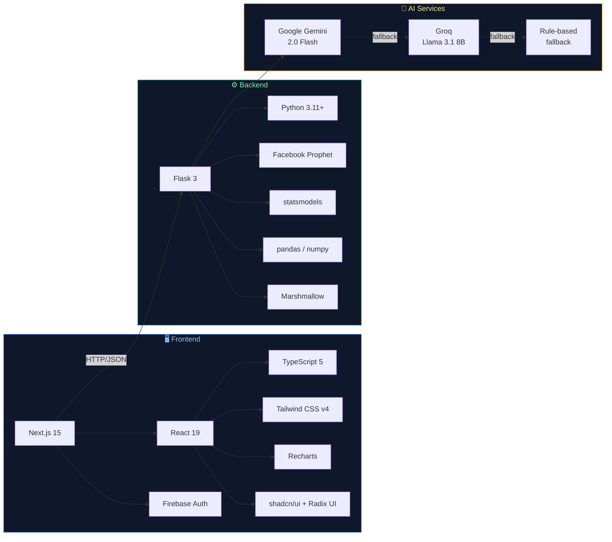

---

## Install and Run

### Prerequisites

| Requirement | Notes |
|---|---|
| Node.js 18+ and npm | Required for the frontend |
| Python 3.11+ | Required for the backend |
| Google Gemini API key | Optional — free at https://aistudio.google.com/app/apikey |
| Groq API key | Optional — free at https://console.groq.com |
| Firebase project | Required for login/signup — free at https://console.firebase.google.com |

> **No AI keys? No problem.** Prophet forecasting, anomaly detection, and scenario modelling run entirely locally. AI keys only add natural-language explanations.

### Setup Flow

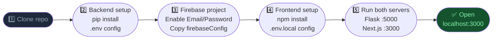

---

### Step 1 — Clone the repository

```bash
git clone https://github.com/your-username/forecastiq.git
cd forecastiq
```

---

### Step 2 — Backend setup

```bash
cd backend

# Create and activate virtual environment
python -m venv venv
source venv/bin/activate        # macOS / Linux
# venv\Scripts\activate         # Windows

# Install Python dependencies
pip install -r requirements.txt

# Configure environment variables
cp .env.example .env
# Open .env and fill in your values (see Environment Variables section)

# Start the Flask backend
python app.py
# → Running on http://localhost:5000
```

Verify the backend is running:

```bash
curl http://localhost:5000/health
# {"status": "ok", "version": "1.0.0"}
```

---

### Step 3 — Firebase project setup

1. Go to https://console.firebase.google.com → create a new project
2. In **Build → Authentication**, click **Get started** → enable **Email/Password**
3. In **Project Settings → Your apps**, click **Add app → Web**, register an app
4. Copy the `firebaseConfig` object — you need these values in Step 4

---

### Step 4 — Frontend setup

```bash
cd ../frontend

# Install Node dependencies
npm install

# Configure environment variables
cp .env.local.example .env.local
# Open .env.local and fill in all values (see Environment Variables section)

# Start the Next.js development server
npm run dev
# → Running on http://localhost:3000
```

Open **http://localhost:3000** in your browser.

---

## Usage Examples

### Demo mode (no upload needed)

1. Open **http://localhost:3000** and click **Get Started**
2. Sign up or log in with any email and password via Firebase Auth
3. You land on the **Forecast** tab — the app auto-runs a Prophet forecast on the bundled `demo_sales.csv`
4. Explore the **Anomalies** and **Scenario** tabs

---

### Upload your own CSV

Navigate to **http://localhost:3000/app/upload**, drag a CSV file onto the dropzone, select the date and value columns, then click **Use this data**.

Minimum CSV format:

```csv
date,sales
2023-01-02,3421
2023-01-09,3689
2023-01-16,3512
2023-01-23,3801
```

| Requirement | Detail |
|---|---|
| Format | `.csv` with headers in first row |
| Minimum rows | 8 valid data points after cleaning |
| Date column | Any parseable format (`YYYY-MM-DD` recommended) |
| Value column | Numeric integers or decimals |
| Frequency | Weekly recommended; daily also works |

---

### Reading a forecast

The Forecast tab shows:

- **KPI cards** — trend %, peak week, confidence range, delta vs baseline
- **AI insight** — 2-sentence plain-English summary
- **Interactive chart** — historical actuals (solid), Prophet forecast (dashed), upper/lower confidence bands (shaded area), moving average baseline (dotted)
- **Transparency panel** — which model was used and its MAE score on holdout data

Sample API call:

```bash
curl -X POST http://localhost:5000/api/forecast \
  -H "Content-Type: application/json" \
  -d '{
    "data": [
      {"date": "2024-01-01", "value": "3500"},
      {"date": "2024-01-08", "value": "3689"}
    ],
    "date_column": "date",
    "value_column": "value",
    "periods": 4,
    "use_demo": false
  }'
```

Sample response:

```json
{
  "success": true,
  "data": {
    "historical": [{ "date": "2024-01-01", "value": 3500, "baseline": 3450 }],
    "forecast": [
      {
        "date": "2024-02-05",
        "yhat": 4100,
        "yhat_lower": 3800,
        "yhat_upper": 4400,
        "baseline": 3800
      }
    ],
    "summary": {
      "trend_pct": 8.5,
      "peak_week": "Week 3",
      "confidence_range": 600,
      "vs_baseline_pct": 5.2
    },
    "insight": "Sales are forecast to grow 8.5% over the next 4 weeks, with a seasonal spike expected in Week 3.",
    "transparency": { "model_used": "Prophet", "local_meta": {} }
  },
  "error": null
}
```

---

### Detecting anomalies

Click the **Anomalies** tab. The chart renders your data with a rolling ±2σ band; points outside the band are flagged with severity badges.

Each anomaly card shows:

```
Date: 2024-04-15   Value: 6,200   Deviation: 3.8σ   Severity: HIGH
Cause:  Spike likely driven by a promotional event or data entry error.
Action: Cross-check against campaign calendar and verify source data.
```

Sample API call:

```bash
curl -X POST http://localhost:5000/api/anomalies \
  -H "Content-Type: application/json" \
  -d '{
    "data": [{"date": "2024-01-01", "value": "3500"}, "..."],
    "date_column": "date",
    "value_column": "value",
    "use_demo": false
  }'
```

Sample response:

```json
{
  "success": true,
  "data": {
    "chart_data": [
      {
        "date": "2024-04-15",
        "value": 6200,
        "rollingMean": 3500,
        "upperBand": 4900,
        "lowerBand": 2100,
        "isAnomaly": true,
        "anomalySeverity": "HIGH",
        "deviation": 3.8
      }
    ],
    "anomalies": [
      {
        "date": "2024-04-15",
        "value": 6200,
        "severity": "HIGH",
        "deviation": 3.8,
        "cause": "Spike likely driven by a promotional event or data entry error.",
        "action": "Cross-check against campaign calendar and verify source data."
      }
    ],
    "stats": { "total": 1, "high": 1, "medium": 0 }
  },
  "error": null
}
```

---

### Running a scenario

On the **Scenario** tab, type a question in the chat and press Enter:

```
"What if I run a 20% marketing push for 2 weeks?"
"What happens if demand drops 15%?"
"Continue the recent trend for 4 weeks."
"What if we flatten growth next month?"
```

The chart updates in real time showing baseline vs scenario side-by-side with a plain-English summary and projected delta.

Sample API call:

```bash
curl -X POST http://localhost:5000/api/scenario \
  -H "Content-Type: application/json" \
  -d '{
    "question": "What if I run a 20% marketing push for 2 weeks?",
    "baseline_forecast": [{ "date": "2024-02-05", "yhat": 4100 }],
    "history": [],
    "use_demo": false
  }'
```

Sample response:

```json
{
  "success": true,
  "data": {
    "scenario_data": [{ "week": "Week 1", "baseline": 4100, "scenario": 4920 }],
    "summary": "A 20% marketing push is projected to add ~2,800 units over 4 weeks vs. the baseline of 15,900.",
    "delta": 2800
  },
  "error": null
}
```

---

## API Reference

All endpoints under `http://localhost:5000`.

| Method | Endpoint | Description |
|---|---|---|
| `GET` | `/health` | Health check → `{"status":"ok","version":"1.0.0"}` |
| `POST` | `/api/forecast` | Run Prophet forecast; auto-falls back to best local model |
| `POST` | `/api/forecast/compare-cleaned` | Rerun forecast with outliers removed for comparison |
| `POST` | `/api/anomalies` | Rolling z-score anomaly detection |
| `POST` | `/api/scenario` | What-if scenario modelling with AI-generated summary |

All POST endpoints accept `"use_demo": true` to skip uploaded CSV data and use the bundled demo dataset.

### API Endpoint Map

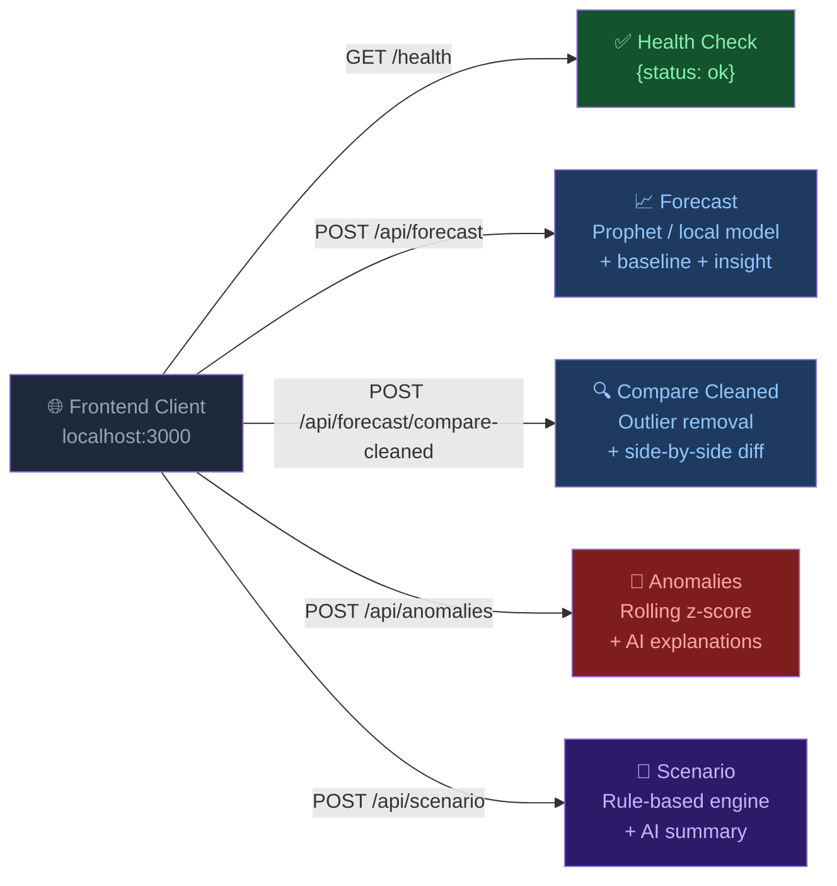

---

## Environment Variables

### Backend — `backend/.env`

| Variable | Required | Default | Description |
|---|---|---|---|
| `GEMINI_API_KEY` | Recommended | — | Google Gemini API key for AI explanations |
| `GROQ_API_KEY` | Optional | — | Groq API key (secondary AI fallback) |
| `FLASK_SECRET_KEY` | Yes (prod) | `dev-secret-key` | Random secret string for Flask sessions |
| `FLASK_ENV` | No | `development` | Set to `production` for deployment |
| `FRONTEND_URL` | No | `http://localhost:3000` | Next.js origin for CORS allow-list |

### Frontend — `frontend/.env.local`

| Variable | Required | Description |
|---|---|---|
| `NEXT_PUBLIC_API_URL` | No (default `http://localhost:5000`) | Flask backend base URL |
| `NEXT_PUBLIC_FIREBASE_API_KEY` | **Yes** | Firebase Web API key |
| `NEXT_PUBLIC_FIREBASE_AUTH_DOMAIN` | **Yes** | Firebase Auth domain (e.g. `project.firebaseapp.com`) |
| `NEXT_PUBLIC_FIREBASE_PROJECT_ID` | **Yes** | Firebase project ID |
| `NEXT_PUBLIC_FIREBASE_STORAGE_BUCKET` | No | Firebase storage bucket |
| `NEXT_PUBLIC_FIREBASE_MESSAGING_SENDER_ID` | No | Firebase messaging sender ID |
| `NEXT_PUBLIC_FIREBASE_APP_ID` | **Yes** | Firebase app ID |

---

## Running Tests

```bash
cd backend
source venv/bin/activate   # if not already active

# Run all tests
pytest tests/ -v

# Run individual files
pytest tests/test_anomaly.py -v
pytest tests/test_baseline.py -v
pytest tests/test_csv_parser.py -v
```

### Test Coverage Map

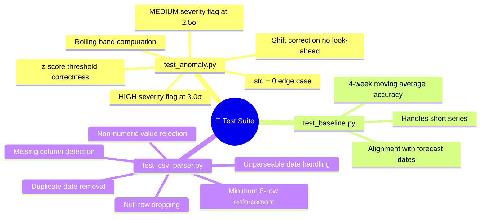

---

## Troubleshooting

**Backend won't start**

```
ModuleNotFoundError: prophet
→ pip install prophet
  On Apple Silicon: brew install cmake  then  pip install prophet

ModuleNotFoundError: google.generativeai
→ pip install google-generativeai==0.7.2

ModuleNotFoundError: groq
→ pip install groq==0.9.0

Port 5000 already in use
→ Change port=5000 in app.py and update NEXT_PUBLIC_API_URL in frontend/.env.local
```

**Frontend errors**

```
Firebase auth/invalid-api-key
→ Verify all NEXT_PUBLIC_FIREBASE_* values in .env.local match your Firebase console

Network Error / CORS error in browser console
→ Check FRONTEND_URL in backend/.env matches your Next.js URL exactly (including port)

Cannot find module '@/context/DataContext'
→ Confirm frontend/context/DataContext.tsx exists after cloning
```

**API returns `{ "success": false }`**

```
"Only N valid rows found"
→ CSV has fewer than 8 clean rows. Check for blank rows, non-numeric values, bad dates.

"Date column 'X' not found"
→ Use the Upload page column selector to choose the correct column name.

Gemini errors in backend logs
→ App falls back to Groq then to rule-based text automatically.
  Set a valid GEMINI_API_KEY in backend/.env for full AI responses.
```

### Troubleshooting Decision Tree

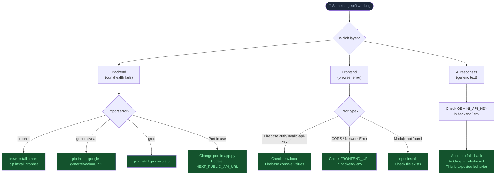

---

## Production Deployment

**Backend** — replace Flask dev server with Gunicorn:

```bash
pip install gunicorn
gunicorn -w 2 -b 0.0.0.0:5000 app:app
```

**Frontend** — build and serve:

```bash
npm run build
npm start
```

**Pre-deployment secrets checklist:**

```bash
# Generate a strong Flask secret key
python -c "import secrets; print(secrets.token_hex(32))"

# Update backend/.env
FLASK_ENV=production
FLASK_SECRET_KEY=<generated value>
FRONTEND_URL=https://your-production-domain.com

# Update frontend/.env.local
NEXT_PUBLIC_API_URL=https://your-api-domain.com
```

> Never commit `.env` or `.env.local` to source control. Both are already listed in their respective `.gitignore` files.

---

## Limitations

- **Voice input** — the microphone button renders in the Scenario tab UI but speech-to-text transcription is not yet wired to the chat input. It is a visual placeholder only.
- **Authentication scope** — Firebase Auth secures the frontend. The Flask backend restricts requests via CORS origin allow-listing; individual API routes do not verify Firebase JWT tokens, so a direct `curl` to the backend bypasses auth.
- **Forecast horizon** — optimised for 1–6 week ahead forecasts on weekly-frequency data. Very long horizons or sub-daily granularity reduce Prophet accuracy.
- **CSV only** — data ingestion supports `.csv` files; Excel, JSON, and database connections are not supported.
- **Single time series** — forecasts one value column at a time; multi-variate inputs are not supported.

---

## Future Improvements

Given more time, the following would be prioritised:

- Wire `VoiceButton` to the Web Speech API for hands-free scenario questions
- Add Firebase JWT verification to Flask API routes for full per-user data isolation
- Support Excel (`.xlsx`) and JSON file uploads alongside CSV
- Add a `/api/forecast/export` endpoint to download forecast results as a CSV file
- Introduce Prophet external regressors (e.g. marketing spend as a causal input variable)
- Build a `docs/` folder with a live demo link and screenshot gallery

### Roadmap

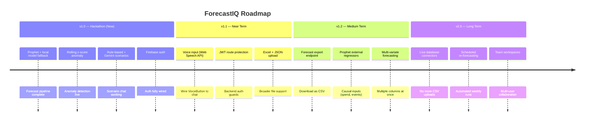

---

## License

Apache License 2.0

All commits are DCO signed-off (`git commit -s`) as required by the NatWest Code for Purpose Hackathon submission guidelines. This project is submitted in a personal capacity and is not official company work.

---

<div align="center">

Built with Prophet, Gemini, and a lot of coffee for NatWest Code for Purpose 2026

</div>