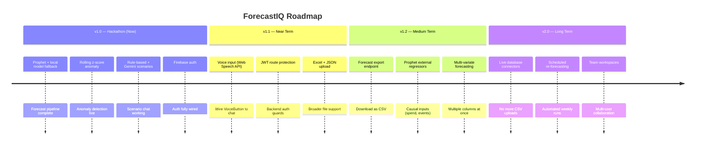

<div align="center">

# ForecastIQ™

### AI Predictive Forecasting Platform
**NatWest Code for Purpose Hackathon — AI Predictive Forecasting Track**

[](https://flask.palletsprojects.com/)
[](https://nextjs.org/)
[](https://facebook.github.io/prophet/)
[](https://aistudio.google.com/)
[](https://www.typescriptlang.org/)
[](https://www.python.org/)
[](LICENSE)
[](https://developercertificate.org/)

<br/>


[](https://git.io/typing-svg)


</div>


## Overview

**ForecastIQ** transforms raw historical CSV data into actionable predictions — no data science expertise required. Most teams only look backwards at their data; ForecastIQ gives them a transparent, accessible window into what the future may hold.

Upload any time-series CSV and within seconds get **Prophet-powered forecasts** with honest uncertainty bands, **rolling z-score anomaly alerts** with AI-generated plain-English explanations, and a conversational **"what-if" scenario engine** — all without writing a single line of code.

Built on a **graceful degradation philosophy**: the platform always produces output. With AI keys it delivers rich, contextual Gemini-powered insights. Without them, it falls back seamlessly to local statistical models and deterministic rule-based explanations — zero dependencies, zero failures.

The platform is **completely free and open to use** — no account, no sign-up, no login. Just upload your data and start forecasting.

**Intended users:** Business analysts, operations teams, product managers, and anyone working with time-series metrics — sales, traffic, usage, churn — who needs fast, trustworthy, explainable forecasts without a data science background.

### Why ForecastIQ?

| | ForecastIQ | Traditional BI Tools | Hiring a Data Scientist |
|---|---|---|---|
| **Setup time** | Seconds | Days | Weeks |
| **Expertise needed** | None | Moderate | High |
| **Uncertainty bands** | ✅ Built-in | ❌ Rarely | ✅ Possible |
| **Plain English output** | ✅ Always | ❌ No | ⚠️ Sometimes |
| **Cost** | ✅ Free | 💰 Paid | 💰💰 Expensive |
| **Works offline** | ✅ Yes | ❌ No | ❌ No |

---

## Features

### 🔮 Forecast Tab

<div align="center">
 
</div>

| Feature | Description |
|---------|-------------|
| **Prophet Forecasting** | Generates 1–6 week ahead forecasts with low / likely / high uncertainty bands using Facebook Prophet |
| **Local Model Fallback** | Automatically selects the best local model (Naive, Seasonal Naive, Moving Average, Holt, Holt-Winters) by holdout MAE when Prophet is unavailable |
| **Moving Average Baseline** | Every forecast is benchmarked against a 4-week moving average to prevent overfitting claims |
| **Outlier-Aware Comparison** | Reruns the forecast with statistical outliers removed for side-by-side contrast |
| **Transparency Panel** | Every forecast response exposes `model_used` and per-model MAE scores |
| **Demo Mode** | Ships with `demo_sales.csv` (52 weeks of synthetic data) for instant end-to-end testing |

---

### 🔴 Anomaly Detection

<div align="center">
  
</div>

| Feature | Description |
|---------|-------------|
| **Rolling Z-Score Detection** | Flags unexpected spikes and dips at HIGH (≥ 3σ) and MEDIUM (≥ 2.5σ) severity with shift-corrected windows — zero look-ahead bias |
| **Severity Badges** | Every anomaly is classified as HIGH or MEDIUM so you know exactly what needs urgent attention |
| **AI Root Cause Analysis** | Gemini 2.0 Flash generates a likely cause and recommended next action for each detected anomaly |
| **Rolling Band Visualisation** | Interactive chart renders the ±2σ rolling band alongside your actuals — outliers jump out instantly |
| **Graceful AI Fallback** | No Gemini key? Groq kicks in. No Groq? Rule-based explanations fire automatically — never fails silently |

---


### 💬 Scenario Analysis

<div align="center">
  
</div>

| Feature | Description |
|---------|-------------|
|  **Scenario Chat** | Ask any what-if question in plain English — "What if I run a 20% marketing push for 2 weeks?" — and get a fully modelled response with numbers |
|  **Baseline vs Scenario Chart** | Side-by-side bar chart shows exactly how your scenario diverges from the baseline forecast week by week |
| **Projected Delta** | The net impact of your scenario is calculated and displayed instantly — no spreadsheets needed |
|  **Multi-Turn Conversation** | Ask follow-up questions and iterate on your scenario in a natural back-and-forth chat |
|  **Voice Input** | Speak your scenario question hands-free via Web Speech API — supported on Chrome and Edge |
|  **Rule-Based Engine** | Deterministic modelling for %, trend continuation, flatten, and outlier-removal scenarios — never fails without AI keys |
|  **Drag-and-Drop CSV Upload** | Browser-side parser with auto column detection and ≥ 8 row validation — no server roundtrip |
|  **No Sign-Up Required** | Completely open platform — users land directly on the app with no login gate |
|  **Responsive UI** | Mobile sidebar navigation, Recharts interactive charts, shadcn/ui, Tailwind CSS v4 |

---

## Install and Run

### Prerequisites

| Requirement | Version | Notes |
|-------------|---------|-------|
| Node.js | 18+ | Required for the frontend |
| Python | 3.11+ | Required for the backend |
| Google Gemini API key | — | Optional — free at [aistudio.google.com](https://aistudio.google.com/app/apikey) |
| Groq API key | — | Optional — free at [console.groq.com](https://console.groq.com) |

> **No AI keys? No problem.** Prophet forecasting, anomaly detection, and scenario modelling all run entirely locally. AI keys only add natural-language explanations.

---

### Step 1 — Clone the repository

```bash
git clone https://github.com/your-username/forecastiq.git
cd forecastiq
```

---

### Step 2 — Backend setup

```bash
cd backend

# Create and activate virtual environment
python -m venv venv
source venv/bin/activate        # macOS / Linux
venv\Scripts\activate           # Windows

# Install dependencies
pip install -r requirements.txt

# Set up environment variables
cp .env.example .env
# Open .env and fill in your values (see Environment Variables section)

# Start the Flask backend
python app.py
# → Running on http://localhost:5000
```

Verify it is running:

```bash
curl http://localhost:5000/health
# {"status": "ok", "version": "1.0.0"}
```

---

### Step 3 — Frontend setup

```bash
cd ../frontend

# Install dependencies
npm install

# Set up environment variables
cp .env.local.example .env.local
# Open .env.local and set NEXT_PUBLIC_API_URL if needed

# Start the development server
npm run dev
# → Running on http://localhost:3000
```

---

### Step 4 — Open the app

Open **http://localhost:3000** in your browser — no sign-up or login required. The app loads with demo data pre-configured so you can explore all features immediately.

---

> **Apple Silicon (M1/M2/M3) users:** Prophet requires cmake. Run `brew install cmake` before `pip install -r requirements.txt`.

---

##  Tech Stack

| Layer | Technology | Purpose |
|-------|------------|---------|
| **Frontend** |    | App Router, type safety, fast dev experience |
| **Styling** |    | Utility-first; accessible component primitives |
| **Charts** |  | Declarative React charting with confidence band support |
| **Backend** |    | Lightweight API layer; easy Prophet/pandas integration |
| **Primary Forecast** |  | Decomposes series into trend + seasonality; uncertainty intervals built-in; trains in < 1s |
| **Fallback Forecast**|  | No external API; winner selected by holdout MAE |
| **Anomaly Detection**|   | Interpretable, auditable, no black box |
| **Primary AI** |  | Free tier, 1M token context, fast inference |
| **AI Fallback** |   | Sub-second latency; free tier |
| **Voice Input** |  | Native browser speech-to-text; no external dependency |
| **Validation** |   | Schema validation at both API layers |
| **Testing** |  | Standard Python testing; clear test structure |


---

## System Architecture

The diagram below shows the full runtime topology: browser, Next.js, Flask, and external AI services.


---

## Folder Structure

```
forecastiq/
│
├── README.md
│
├── backend/                            Flask 3 Python API
│   ├── app.py                          Application factory + blueprint registration
│   ├── config.py                       Centralised env var loading (single source of truth)
│   ├── requirements.txt                Python dependencies
│   ├── demo_sales.csv                  52-week synthetic dataset for demo mode
│   ├── .env.example                    Environment variable template (no real secrets)
│   ├── .gitignore
│   │
│   ├── routes/
│   │   ├── __init__.py
│   │   ├── forecast.py                 POST /api/forecast + /api/forecast/compare-cleaned
│   │   ├── anomalies.py                POST /api/anomalies
│   │   └── scenario.py                 POST /api/scenario
│   │
│   ├── services/
│   │   ├── __init__.py
│   │   ├── prophet_service.py          Facebook Prophet wrapper (auto-tuned hyperparams)
│   │   ├── local_models_service.py     5 local models, selected by holdout MAE
│   │   ├── anomaly_service.py          Rolling z-score, shift-corrected windows
│   │   ├── baseline_service.py         4-week moving average reference line
│   │   ├── scenario_engine.py          Deterministic rule-based scenario modeller
│   │   ├── outlier_service.py          Outlier removal + cleaned forecast comparison
│   │   └── gemini_service.py           Gemini → Groq → static text fallback chain
│   │
│   ├── utils/
│   │   ├── __init__.py
│   │   └── csv_parser.py               CSV validation + pandas DataFrame builder
│   │
│   └── tests/
│       ├── __init__.py
│       ├── test_anomaly.py             Pytest: z-score correctness, severity flags, bands
│       ├── test_baseline.py            Pytest: moving average computation accuracy
│       └── test_csv_parser.py          Pytest: edge cases — bad dates, missing cols, nulls
│
└── frontend/                           Next.js 15 TypeScript application
    ├── package.json
    ├── next.config.mjs
    ├── tsconfig.json
    ├── .env.local.example              Frontend env var template (no real secrets)
    ├── .gitignore
    │
    ├── app/
    │   ├── layout.tsx                  Root layout (fonts, global styles)
    │   ├── page.tsx                    Public landing page
    │   ├── login/page.tsx              Firebase sign-in form
    │   ├── signup/page.tsx             Firebase account creation
    │   └── app/                        Protected shell (AuthGuard required)
    │       ├── layout.tsx              DataProvider + Sidebar + MobileNav
    │       ├── page.tsx                Forecast tab (Prophet chart + KPI cards)
    │       ├── anomalies/page.tsx      Anomaly detection tab
    │       ├── scenario/page.tsx       Scenario chat tab
    │       └── upload/page.tsx         CSV upload + column selector
    │
    ├── components/
    │   ├── AuthGuard.tsx               Redirects unauthenticated users to /login
    │   └── forecastiq/
    │       ├── charts/
    │       │   ├── forecast-chart.tsx  Recharts: actuals + forecast + CI bands + baseline
    │       │   ├── anomaly-chart.tsx   Recharts: rolling band + flagged anomaly points
    │       │   └── scenario-chart.tsx  Recharts: baseline vs scenario comparison
    │       ├── anomaly-card.tsx        Per-anomaly explanation + severity badge
    │       ├── csv-upload.tsx          Drag-and-drop + column selection UI
    │       ├── data-summary.tsx        Forecast data table
    │       ├── insight-card.tsx        AI-generated insight display block
    │       ├── scenario-chat.tsx       Multi-turn chat + chart update on response
    │       ├── stat-card.tsx           KPI metric card (trend %, peak week, range)
    │       ├── voice-button.tsx        Microphone toggle (UI only — see Limitations)
    │       ├── app-sidebar.tsx         Desktop navigation sidebar
    │       ├── app-topbar.tsx          Page header + Run Analysis button
    │       └── mobile-nav.tsx          Bottom navigation for mobile
    │
    ├── context/
    │   ├── AuthContext.tsx             Firebase auth state (user, loading, listeners)
    │   └── DataContext.tsx             CSV data + all API results (global state)
    │
    └── lib/
        ├── api.ts                      All fetch calls to Flask backend
        ├── auth.ts                     Firebase sign-in / sign-up / sign-out helpers
        ├── firebase.ts                 Firebase app initialisation (env-only, no hardcoding)
        ├── demo-data.ts                Fallback demo data for UI previews
        └── utils.ts                    Tailwind class merger (cn utility)
```


## Usage Examples

### Demo mode (no upload needed)

1. Open **http://localhost:3000** and click **Get Started**
2. Sign up or log in with any email and password via Firebase Auth
3. You land on the **Forecast** tab — the app auto-runs a Prophet forecast on the bundled `demo_sales.csv`
4. Explore the **Anomalies** and **Scenario** tabs

---

### Upload your own CSV

Navigate to **http://localhost:3000/app/upload**, drag a CSV file onto the dropzone, select the date and value columns, then click **Use this data**.

Minimum CSV format:

```csv
date,sales
2023-01-02,3421
2023-01-09,3689
2023-01-16,3512
2023-01-23,3801
```

| Requirement | Detail |
|---|---|
| Format | `.csv` with headers in first row |
| Minimum rows | 8 valid data points after cleaning |
| Date column | Any parseable format (`YYYY-MM-DD` recommended) |
| Value column | Numeric integers or decimals |
| Frequency | Weekly recommended; daily also works |

---

### Reading a forecast

The Forecast tab shows:

- **KPI cards** — trend %, peak week, confidence range, delta vs baseline
- **AI insight** — 2-sentence plain-English summary
- **Interactive chart** — historical actuals (solid), Prophet forecast (dashed), upper/lower confidence bands (shaded area), moving average baseline (dotted)
- **Transparency panel** — which model was used and its MAE score on holdout data

Sample API call:

```bash
curl -X POST http://localhost:5000/api/forecast \
  -H "Content-Type: application/json" \
  -d '{
    "data": [
      {"date": "2024-01-01", "value": "3500"},
      {"date": "2024-01-08", "value": "3689"}
    ],
    "date_column": "date",
    "value_column": "value",
    "periods": 4,
    "use_demo": false
  }'
```

Sample response:

```json
{
  "success": true,
  "data": {
    "historical": [{ "date": "2024-01-01", "value": 3500, "baseline": 3450 }],
    "forecast": [
      {
        "date": "2024-02-05",
        "yhat": 4100,
        "yhat_lower": 3800,
        "yhat_upper": 4400,
        "baseline": 3800
      }
    ],
    "summary": {
      "trend_pct": 8.5,
      "peak_week": "Week 3",
      "confidence_range": 600,
      "vs_baseline_pct": 5.2
    },
    "insight": "Sales are forecast to grow 8.5% over the next 4 weeks, with a seasonal spike expected in Week 3.",
    "transparency": { "model_used": "Prophet", "local_meta": {} }
  },
  "error": null
}
```

---

### Detecting anomalies

Click the **Anomalies** tab. The chart renders your data with a rolling ±2σ band; points outside the band are flagged with severity badges.

Each anomaly card shows:

```
Date: 2024-04-15   Value: 6,200   Deviation: 3.8σ   Severity: HIGH
Cause:  Spike likely driven by a promotional event or data entry error.
Action: Cross-check against campaign calendar and verify source data.
```

Sample API call:

```bash
curl -X POST http://localhost:5000/api/anomalies \
  -H "Content-Type: application/json" \
  -d '{
    "data": [{"date": "2024-01-01", "value": "3500"}, "..."],
    "date_column": "date",
    "value_column": "value",
    "use_demo": false
  }'
```

Sample response:

```json
{
  "success": true,
  "data": {
    "chart_data": [
      {
        "date": "2024-04-15",
        "value": 6200,
        "rollingMean": 3500,
        "upperBand": 4900,
        "lowerBand": 2100,
        "isAnomaly": true,
        "anomalySeverity": "HIGH",
        "deviation": 3.8
      }
    ],
    "anomalies": [
      {
        "date": "2024-04-15",
        "value": 6200,
        "severity": "HIGH",
        "deviation": 3.8,
        "cause": "Spike likely driven by a promotional event or data entry error.",
        "action": "Cross-check against campaign calendar and verify source data."
      }
    ],
    "stats": { "total": 1, "high": 1, "medium": 0 }
  },
  "error": null
}
```

---

### Running a scenario

On the **Scenario** tab, type a question in the chat and press Enter:

```
"What if I run a 20% marketing push for 2 weeks?"
"What happens if demand drops 15%?"
"Continue the recent trend for 4 weeks."
"What if we flatten growth next month?"
```

The chart updates in real time showing baseline vs scenario side-by-side with a plain-English summary and projected delta.

Sample API call:

```bash
curl -X POST http://localhost:5000/api/scenario \
  -H "Content-Type: application/json" \
  -d '{
    "question": "What if I run a 20% marketing push for 2 weeks?",
    "baseline_forecast": [{ "date": "2024-02-05", "yhat": 4100 }],
    "history": [],
    "use_demo": false
  }'
```

Sample response:

```json
{
  "success": true,
  "data": {
    "scenario_data": [{ "week": "Week 1", "baseline": 4100, "scenario": 4920 }],
    "summary": "A 20% marketing push is projected to add ~2,800 units over 4 weeks vs. the baseline of 15,900.",
    "delta": 2800
  },
  "error": null
}
```

---

## API Reference

All endpoints under `http://localhost:5000`.

| Method | Endpoint | Description |
|---|---|---|
| `GET` | `/health` | Health check → `{"status":"ok","version":"1.0.0"}` |
| `POST` | `/api/forecast` | Run Prophet forecast; auto-falls back to best local model |
| `POST` | `/api/forecast/compare-cleaned` | Rerun forecast with outliers removed for comparison |
| `POST` | `/api/anomalies` | Rolling z-score anomaly detection |
| `POST` | `/api/scenario` | What-if scenario modelling with AI-generated summary |

All POST endpoints accept `"use_demo": true` to skip uploaded CSV data and use the bundled demo dataset.

---

## Environment Variables

### Backend — `backend/.env`

| Variable | Required | Default | Description |
|---|---|---|---|
| `GEMINI_API_KEY` | Recommended | — | Google Gemini API key for AI explanations |
| `GROQ_API_KEY` | Optional | — | Groq API key (secondary AI fallback) |
| `FLASK_SECRET_KEY` | Yes (prod) | `dev-secret-key` | Random secret string for Flask sessions |
| `FLASK_ENV` | No | `development` | Set to `production` for deployment |
| `FRONTEND_URL` | No | `http://localhost:3000` | Next.js origin for CORS allow-list |

### Frontend — `frontend/.env.local`

| Variable | Required | Description |
|---|---|---|
| `NEXT_PUBLIC_API_URL` | No (default `http://localhost:5000`) | Flask backend base URL |

---

## Running Tests

```bash
cd backend
source venv/bin/activate   # if not already active

# Run all tests
pytest tests/ -v

# Run individual files
pytest tests/test_anomaly.py -v
pytest tests/test_baseline.py -v
pytest tests/test_csv_parser.py -v
```

---

## Troubleshooting

**Backend won't start**

```
ModuleNotFoundError: prophet
→ pip install prophet
  On Apple Silicon: brew install cmake  then  pip install prophet

ModuleNotFoundError: google.generativeai
→ pip install google-generativeai==0.7.2

ModuleNotFoundError: groq
→ pip install groq==0.9.0

Port 5000 already in use
→ Change port=5000 in app.py and update NEXT_PUBLIC_API_URL in frontend/.env.local
```

**Frontend errors**

```
Firebase auth/invalid-api-key
→ Verify all NEXT_PUBLIC_FIREBASE_* values in .env.local match your Firebase console

Network Error / CORS error in browser console
→ Check FRONTEND_URL in backend/.env matches your Next.js URL exactly (including port)

Cannot find module '@/context/DataContext'
→ Confirm frontend/context/DataContext.tsx exists after cloning
```

**API returns `{ "success": false }`**

```
"Only N valid rows found"
→ CSV has fewer than 8 clean rows. Check for blank rows, non-numeric values, bad dates.

"Date column 'X' not found"
→ Use the Upload page column selector to choose the correct column name.

Gemini errors in backend logs
→ App falls back to Groq then to rule-based text automatically.
  Set a valid GEMINI_API_KEY in backend/.env for full AI responses.
```

---

## Production Deployment

**Backend** — replace Flask dev server with Gunicorn:

```bash
pip install gunicorn
gunicorn -w 2 -b 0.0.0.0:5000 app:app
```

**Frontend** — build and serve:

```bash
npm run build
npm start
```

**Pre-deployment secrets checklist:**

```bash
# Generate a strong Flask secret key
python -c "import secrets; print(secrets.token_hex(32))"

# Update backend/.env
FLASK_ENV=production
FLASK_SECRET_KEY=<generated value>
FRONTEND_URL=https://your-production-domain.com

# Update frontend/.env.local
NEXT_PUBLIC_API_URL=https://your-api-domain.com
```

> Never commit `.env` or `.env.local` to source control. Both are already listed in their respective `.gitignore` files.

---

## Limitations

- **Voice input** — the microphone button renders in the Scenario tab UI but speech-to-text transcription is not yet wired to the chat input. It is a visual placeholder only.
- **Authentication scope** — Firebase Auth secures the frontend. The Flask backend restricts requests via CORS origin allow-listing; individual API routes do not verify Firebase JWT tokens, so a direct `curl` to the backend bypasses auth.
- **Forecast horizon** — optimised for 1–6 week ahead forecasts on weekly-frequency data. Very long horizons or sub-daily granularity reduce Prophet accuracy.
- **CSV only** — data ingestion supports `.csv` files; Excel, JSON, and database connections are not supported.
- **Single time series** — forecasts one value column at a time; multi-variate inputs are not supported.

---

## Future Improvements

Given more time, the following would be prioritised:

- Wire `VoiceButton` to the Web Speech API for hands-free scenario questions
- Add Firebase JWT verification to Flask API routes for full per-user data isolation
- Support Excel (`.xlsx`) and JSON file uploads alongside CSV
- Add a `/api/forecast/export` endpoint to download forecast results as a CSV file
- Introduce Prophet external regressors (e.g. marketing spend as a causal input variable)
- Build a `docs/` folder with a live demo link and screenshot gallery

### Roadmap



---

## License

Apache License 2.0

All commits are DCO signed-off (`git commit -s`) as required by the NatWest Code for Purpose Hackathon submission guidelines. This project is submitted in a personal capacity and is not official company work.

---

<div align="center">

Built with Prophet, Gemini, and a lot of coffee for NatWest Code for Purpose 2026

</div>

<div align="center">
<pre>
███████╗ ██████╗ ██████╗ ███████╗ ██████╗ █████╗ ███████╗████████╗██╗ ██████╗
██╔════╝██╔═══██╗██╔══██╗██╔════╝██╔════╝██╔══██╗██╔════╝╚══██╔══╝██║██╔═══██╗
█████╗  ██║   ██║██████╔╝█████╗  ██║     ███████║███████╗   ██║   ██║██║   ██║
██╔══╝  ██║   ██║██╔══██╗██╔══╝  ██║     ██╔══██║╚════██║   ██║   ██║██║▄▄ ██║
██║     ╚██████╔╝██║  ██║███████╗╚██████╗██║  ██║███████║   ██║   ██║╚██████╔╝
╚═╝      ╚═════╝ ╚═╝  ╚═╝╚══════╝ ╚═════╝╚═╝  ╚═╝╚══════╝   ╚═╝   ╚═╝ ╚══▀▀═╝
</pre>
</div>
